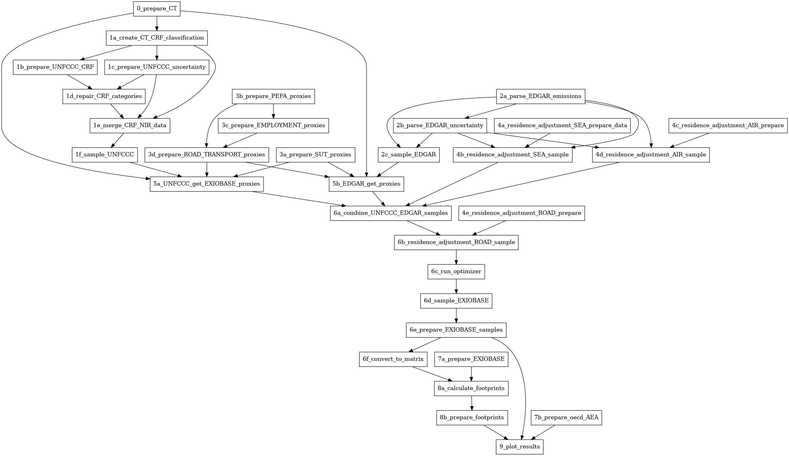

<!-- README.md is generated from README.Rmd. Please edit that file -->

# Estimating the uncertainty of the greenhouse gas emission accounts in Global Multi-Regional Input-Output analysis

This is the code for reproducing the results for our study on
“Estimating the uncertainty of the greenhouse gas emission accounts in
Global Multi-Regional Input-Output analysis” submitted to the Journal of
Earth Systems Science Data (ESSD).

Once published the study will be linked here.

# Getting started

## Data required

To reproduce the results and run the scripts you need to download the
following data:

- From EXIOBASE V3.8.2 `IOT_2015_ixi.zip` and `MRSUT_2015.zip` from
  here: <https://zenodo.org/records/5589597>
- UNFCCC country-submitted greenhouse gas emissions data until
  2020-10-25 from here: <https://zenodo.org/record/4199622>
- EDGAR v5.0 time series data for CO$_2$, CH$_4$ and N$_2$O from here:
  <https://edgar.jrc.ec.europa.eu/dataset_ghg50>
- UNFCCC uncertainty data from here:
  <https://zenodo.org/record/10037714>
- Correspondence table between UNFCCC CRF and EXIOBASE industry sectors
  from here: <https://zenodo.org/record/10046372>
- Supplementary material 2 from Selin et al. (2021):
  <https://doi.org/10.1088/1748-9326/abec02> (The link to the file is a
  bit hidden below the abstract)

The uncertainty data from Solazzo et al. (2021) is already part of this
repository (`./data/tot_GHG_2015_Tier1_sector_countrytotal_cat_.csv`).

## How to run the scripts

Before running the scripts you first need to adapt the `config.yml` file
as follows:

1.  Adjust the paths to the data file (the directory where you saved the
    data downloaded as indicated above)
2.  Adjust the number of cores to the characteristics of your computer
    (The more cores you use, (1) the faster the code runs, but also (2)
    the more RAM you require).

The version number determines where the intermediate results are stored.
This means a subfolder under `./intermediate_results` is created when
you run the scripts the first time with a give version number. Running
the scripts again with the same version number overwrites the results.

The scripts need to be run according to the order indicated. The
dependency graph of the individual scripts is depicted here:

<!-- -->
